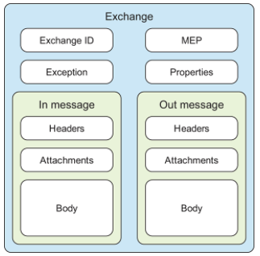
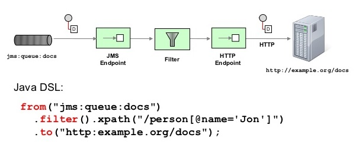

A routing-engine builder

<!-- This is presenter note. You can write down notes through HTML comment. -->

---

# What is Camel?

At the core of the Camel framework is a routing engine—or more precisely, a routing-engine builder. It allows you to define your own routing rules, decide from which sources to accept messages, and determine how to process and send those messages to other destinations. Camel forms the glue between disparate systems.


---

# What is not Camel?

- Camel isn’t an enterprise service bus (ESB), although some call Camel a lightweight ESB because of its support for routing, transformation, orchestration, monitoring, and so forth. 
- Camel doesn’t have a container or a reliable message bus, but it can be deployed in one, such as the previously mentioned Apache ServiceMix. For that reason, we prefer to call Camel an integration framework rather than an ESB.

---

# Why use Camel?

These are the main ideas behind Camel:

  - Routing and mediation engine
  - Extensive component library
  - [Enterprise integration patterns (EIPs)](www.enterpriseintegrationpatterns.com)
  - Domain-specific language
  - Payload-agnostic router
  - POJO model
  - Automatic type converters
  - Lightweight core ideal for microservices
  - Test kit

<!-- 
Routing and mediation engine: The core feature of Camel is its routing and mediation engine. A routing engine selectively moves a message around, based on the route’s configuration. In Camel’s case, routes are configured with a combination of enterprise integration pattern (EIPs) and a domain-specific language (DSL). 

Extensive component library: Camel provides an extensive library of more than 280 components. These components enable Camel to connect over transports, use APIs, and understand data formats: velocity, xquery, facebook, quartz2, spark, jms, netflix/hystrix and so forth. 

The enterprise integration patterns, or EIPs, cataloged in the book Enterprise Integration Patterns (Addison-Wesley, 2003) are helpful not only because they provide a proven solution for a given problem, but also because they help define and communicate the problem itself. Camel is heavily based on EIPs. 

Camel’s domain-specific language (DSL) was a major contribution to the integration space.The purpose of the DSL is to allow the developer to focus on the integration problem rather than on the tool—the programming language. Camel uses Java DSL and XML DSL.

Camel can route any kind of payload; you aren’t restricted to carrying a normalized format such as XML payloads. This freedom means you don’t have to transform your payload into a canonical format to facilitate routing.

POJO model: Plain Old Java Objects (POJOs) are considered first-class citizens in Camel, and Camel strives to let you use beans anywhere and anytime in your integration projects.

Camel has a built-in type-converter mechanism that ships with more than 350 converters. You no longer need to configure type-converter rules to go from byte arrays to strings, for example. And if you need to convert to types that Camel doesn’t support, you can create your own type converter. The best part is that it works under the hood, so you don’t have to worry about it.

Camel’s core can be considered lightweight, with the total library coming in at about 4.9 MB and having only 1.3 MB of runtime dependencies. This makes Camel easy to embed or deploy anywhere you like, such as in a standalone application, microservice, web application, Spring application, Java EE application, OSGi, Spring Boot, WildFly, so forth. 

Camel provides a test kit that makes it easier for you to test your own Camel applications. The same test kit is used extensively to test Camel itself. 
-->

---

# Camel’s Message Model

Camel uses two abstractions for modeling messages:

- **org.apache.camel.Message**: The fundamental entity containing the data being carried and routed in Camel.
- **org.apache.camel.Exchange**: The Camel abstraction for an exchange of messages. This exchange of messages has an in message, and as a reply, an out message.

---

# Message

Messages are the entities used by systems to communicate with each other when using messaging channels. Messages flow in one direction, from a sender to a receiver.


<!--
Headers are values associated with the message, such as sender identifiers, hints about content encoding, authentication information, and so on. Headers are name-value pairs; the name is a unique, case-insensitive string, and the value is of type java.lang.Object. Camel imposes no constraints on the type of the headers. There are also no constraints on the size of headers or on the number of headers included with a message. Headers are stored as a map within the message. A message can also have optional attachments, which are typically used for the web service and email components.. 

The body is of type java.lang.Object, so a message can store any kind of content and any size. It’s up to the application designer to make sure that the receiver can understand the content of the message. When the sender and receiver use different body formats, Camel provides mechanisms to transform the data into an acceptable format, and in those cases the conversion happens automatically with type converters, behind the scenes. 
-->

---

# Exchange

An exchange in Camel is the message’s container during routing. The exchange is the same for the entire lifecycle of routing, but the messages can change-e.g., if messages are transformed from one format to another.



<!-- 
Exchange ID—A unique ID that identifies the exchange. Camel automatically generates the unique ID. 

MEP—A pattern that denotes whether you’re using the InOnly (A one-way message) or InOut (A request-response message) messaging style. When the pattern is InOnly, the exchange contains an in message. For InOut, an out message also exists that contains the reply message for the caller.

Exception—If an error occurs at any time during routing, an Exception will be set in the exception field.

Properties—Similar to message headers, but they last for the duration of the entire exchange. Properties are used to contain global-level information, whereas message headers are specific to a particular message.

In message—This is the input message, which is mandatory. The in message contains the request message.

Out message—This is an optional message that exists only if the MEP is InOut. The out message contains the reply message. 
-->

---

# Camel’s architecture


<!-- 
CamelContext:You can think of it as Camel’s runtime system, which keeps all the pieces together.

Routing engine: Camel’s routing engine is what moves messages under the hood. This engine isn’t exposed to the developer, but you should be aware that it’s there and that it does all the heavy lifting, ensuring that messages are routed properly.

Routes: The simplest way to define a route is as a chain of processors and endpoints.

Processor is a core Camel concept that represents a node capable of using, creating, or modifying an incoming exchange.

Components are the main extension point in Camel. From a programming point of view, components are fairly simple: they’re associated with a name that’s used in a URI, and they act as a factory of endpoints. For example, FileComponent is referred to by file in a URI, and it creates FileEndpoints.
 -->

---

# Endpoint

An endpoint is the Camel abstraction that models the end of a channel through which a system can send or receive messages.


Scheme denotes a component that works like a factory,creating Endpoint based on the remaining parts of the URI. 

---

# Producer 

A producer is the Camel abstraction that refers to an entity capable of sending a message to an endpoint. The producer handles the details of getting the message data compatible with that particular endpoint. 


---

# Consumer

A consumer is the service that receives messages produced by some external system, wraps them in an exchange, and sends them to be processed. Consumers are the source of the exchanges being routed in Camel.


---
# Kinds of consumers

**Event-driven consumer**


<!--
An event-driven consumer listens on a particular messaging channel. It then waits for a client to send messages to it. When a message arrives, the consumer wakes up and takes the message for processing.-->

**Polling consumer**


<!--
the polling consumer actively goes and fetches messages from a particular source, such as an FTP server. The polling consumer is also known as a synchronous receiver in EIP lingo, because it won’t poll for more messages until it’s finished processing the current message.-->

<!--
Many open source projects have proven that the POJO programming model and a lightweight container meet the expectations of today’s businesses. 
Camel recognizes the power of the POJO programming model and goes to great lengths to work with your beans. By using beans, you fulfill an important goal in the software industry: reducing coupling.
 Camel not only offers reduced coupling with beans, but you get the same loose coupling with Camel routes
 -->

---

# Bean

Camel recognizes the power of the POJO programming model and goes to great lengths to work with your beans.

 ### Service Activator pattern


<!--This service activator component invokes a service based on an incoming request and returns an outbound reply. The service activator acts as a mediator between the requester and the POJO service. The requester sends a request to the service activator , which is responsible for adapting the request to a format the POJO service understands (mediating) and passing the request on to the service . The POJO service then returns a reply to the service activator , which passes it back (requiring no translation on the way back) to the waiting requester.

Camel Bean component, which eventually uses org.apache.camel.component.bean.BeanProcessor to do the work.
.-->

Camel uses [Bean EIP](https://camel.apache.org/components/latest/eips/bean-eip.html) to do the work. 

---

# Routing with Camel

Routing is the process by which a message is taken from an input and, based on a set of conditions, sent to one of several outputs.




<!--
n Camel, routing is a more general concept. It’s defined as a step-by-step movement of the message, which originates from an endpoint in the role of a consumer. The consumer could be receiving the message from an external service, polling for the message on a system, or even creating the message itself. This message then flows through a processing node, which could be an enterprise integration pattern (EIP), a processor, an interceptor, or another custom creation. The message is finally sent to a target endpoint that’s in the role of a producer.
-->

---

# Enterprise Integration Patterns

Camel supports most of the [Enterprise Integration Patterns](https://www.enterpriseintegrationpatterns.com/patterns/messaging/toc.html) from the excellent book by Gregor Hohpe and Bobby Woolf.

 

<!--
The Routing Slip acts as a dynamic router that dictates the next step a message should undergo. .-->


<!--
he Splitter from the EIP patterns allows you split a message into a number of pieces and process them individually.-->

---

## Routing with EIP I - Routing Slip 

```java
  from("direct:start")
    // compute the routing slip at runtime using a bean
    .setHeader("mySlip").method(ComputeSlip.class)
    // use the routing slip EIP
    .routingSlip(header("mySlip"));
```
```java
 public class ComputeSlip {
    public String compute(String body) {
        String answer = "mock:a";
        if (body.contains("Cool")) {
            answer += ",mock:b";
        }
        return answer;
    }
}
```

---

## Routing with EIP II - Split

```java
   from("direct:start")
      .split().method(CustomerService.class, "splitDepartments")
        .to("mock:split");
```
```java
 public class CustomerService {
    public List<Department> splitDepartments(Customer customer) {
        return customer.getDepartments();
    }
    public static Customer createCustomer() {
        List<Department> departments = new ArrayList<Department>();
        departments.add(new Department(222, "Oceanview 66", "89210", "USA"));
        departments.add(new Department(333, "Lakeside 41", "22020", "USA"));
        Customer customer = new Customer(123, "Honda", departments);
        return customer;
    }
}
```

---
# Other issues

- Clustering
- Testing
- Error handling
- Transactions and idempotency
- Parallel processing
- Securing
- Management and monitoring